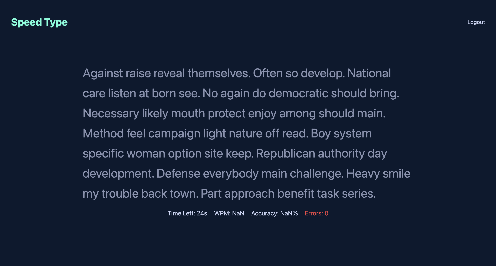

# Speed Type

## Project Overview

The Speed Typing Application is a full-stack web application designed to test and improve users' typing speed and accuracy. The application generates a random paragraph on each refresh, and users must type it as accurately and quickly as possible. Upon completion, they receive a real-time score reflecting their words per minute (WPM) and accuracy. 

---

## Features

- **User Authentication & Authorisation**: Secure user registration and login using JSON Web Tokens (JWT) to ensure that only authenticated users can access and manage their tasks.
- **Random Paragraph Generation**: Each time the page is refreshed, a new random paragraph is fetched from the backend.
- **Responsive Design**: A clean and minimalistic UI designed for a seamless typing experience.

---

## Technology Stack

- **Backend**: Python, Flask
- **Frontend**: React, Tailwind
- **Database**: PostgreSQL
- **Authentication**: JWT

---

## API Documentation

### 1. **POST /register**

**Description**: Register a new user.

**Payload**:

```json
{
  "username": "example",
  "email": "example@hotmail.com",
  "password": "example123"
}
```

### 2. POST /login

**Description**: User login.

**Payload**:

```json
{
  "email": "example@hotmail.com",
  "password": "example123"
}
```

### 3. GET /generated_paragraph

**Description**: Retrieve the randomly generated paragraph (requires JWT token in the header).

**Response**:

```json
{
    "paragraph": "Property treat ahead painting hotel develop employee. Hard check art build room. Green offer in often officer. Although year air dog effect grow government daughter. Again beat hundred car again even. Life friend game buy. Edge safe world. Mean well surface around ago name card yard. Indicate decade dark question movie wish your. Yard fly source fish class Democrat. Gas third marriage he nearly. Because movie fill. As image language ask brother ready."
}
```

### 4. GET /users

**Description**: Retrieve all the users.

**Response**:

```json
{
    "users": [
        {
            "email": "example@hotmail.com",
            "id": 1,
            "username": "example one"
        },
        {
            "email": "example2@outlook.com",
            "id": 2,
            "username": "example two"
        },
        {
            "email": "example3@outlook.com",
            "id": 3,
            "username": "example three"
        }
    ]
}
```

### 5. DELETE /delete_user/:id

**Description**: Delete user using user id.

**Response**:

```json
{
    "message": "User deleted successfully"
}
```

### 6. PUT /update_user

**Description**: Updates user details (requires JWT token in the header).

**Response**:

```json
{
    "message": "User updated successfully"
}
```

---

## Future Improvements

- **Difficulty Levels**: Introduce different difficulty levels (easy, medium, hard) with varying paragraph lengths and word complexity.
- **Achievements & Badges**: Reward users with badges for achieving milestones (e.g., "50 WPM Club", "100% Accuracy Streak").
- **AI-Based Typing Coach**: Implement an AI-powered assistant that gives feedback on typing patterns.

---


